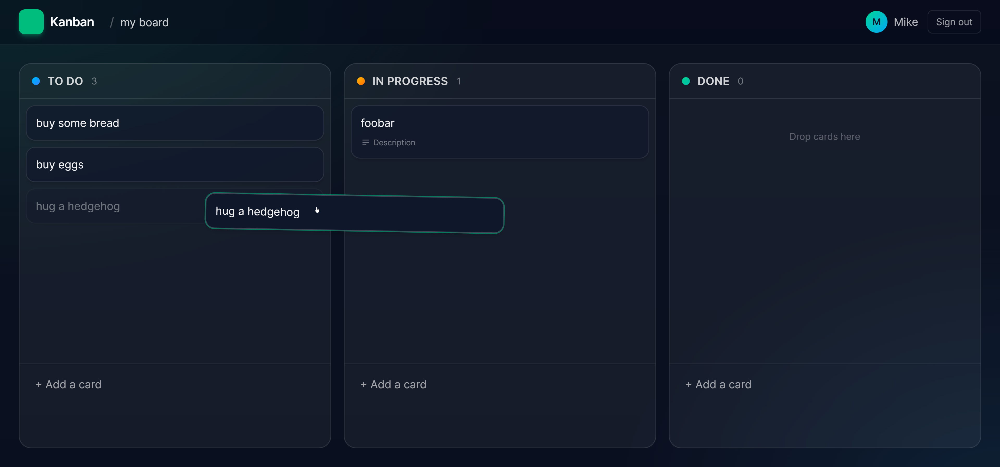

# Convex Todos Playground

A personal playground for experimenting with [Convex](https://convex.dev/) features. The current build is a Trello-style Kanban app — boards with To Do / In Progress / Done columns, drag-and-drop cards, descriptions, and comments — but the goal is to keep iterating here as a sandbox for trying out new Convex capabilities (components, agents, migrations, scheduled functions, auth flows, etc.).

## Stack

- **Backend:** Convex (database, queries, mutations, real-time subscriptions)
- **Frontend:** React 19 + Vite
- **Drag & drop:** [`@dnd-kit`](https://dndkit.com/)
- **Styling:** Tailwind CSS v4

## Getting started

```bash
bun install
bun run dev
```

The first run will prompt you to create or select a Convex deployment.

## Auth

There's no real authentication. On first load you're asked for a name; a `users` row is created and its id is stored in `localStorage`. This is a deliberate playground simplification — anyone with a user id can act as that user, so don't reuse this pattern in anything public.

## Project layout

```
convex/        Backend functions and schema
  schema.ts    users, boards, cards, comments
  boards.ts
  cards.ts
  comments.ts
  users.ts
src/
  App.tsx      Hash-based routing between boards list and a board
  useAuth.ts   localStorage-backed "auth"
  components/  SignIn, TopBar, BoardsList, Board, CardModal
```

## Future experiments

Likely directions: Convex Auth, the migrations component, agent / workflow components, file storage, scheduled functions, and search indexes.
